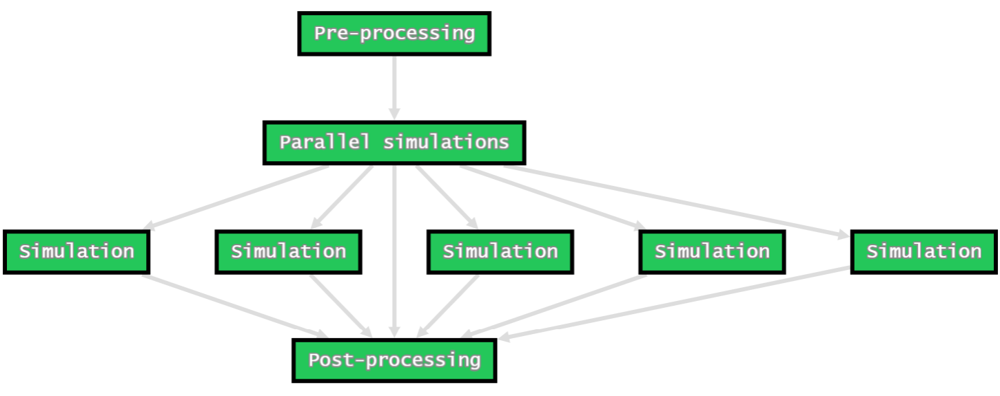
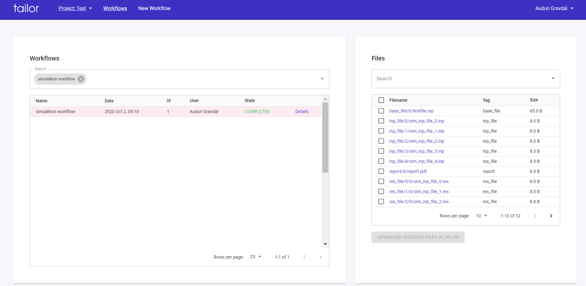
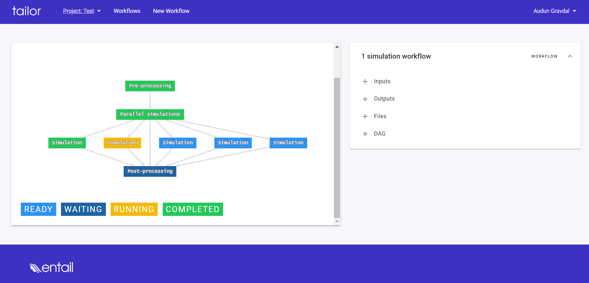

# Welcome to the pyTailor documentation

## What is pyTailor?

pyTailor is a python client for the Tailor automation and collaboration platform. See [Tailor.wf](https://test.tailor.wf) for more information.

With the pyTailor API you can:

- Turn your existing python code into parameterized and reusable workflows.
- Run workflows locally in your computer or distributed to dedicated worker nodes.
- Store your workflows as *workflow definitions* in the Tailor backend and share it with others.

## How does it work?

Let's look at a motivational example. Say you have developed a set of python functions to solve some complex computing or engineering problem, and you have organized these functions into a python module called **engineering_tasks.py**.

Say you have a three-step workflow like this:

1. prepare input data for a set of simulations. This is handled by the function **engineering_tasks.prepare_simulation_data**. Let's say this function:
    - takes a base input file as input.
    - takes a list of parameter dicts for each simulation.
    - produces one simulation input file for each parameter dict.

2. run a set of simulations in parallel. A single simulation is handled by the function **engineering_tasks.run_simulation**. Let's say this function:
    - takes a .inp file as input
    - produces a .res file as output

3. do post-processing of the simulation data.  This is handled by the function **engineering_tasks.post_process_simulation_data**. Let's say this function:
    - takes a set of .res files as input
    - produces a file *report.pdf*
    - returns a dict with essential post-processing results


With pyTailor you can wrap these functions into [PythonTasks](api/taskdefs.md#pythontask), and then use a [DAG](api/taskdefs.md#dag) to define how these tasks relate to each other:


```python
from pytailor import PythonTask, BranchTask, DAG, Inputs, Outputs, Files
import engineering_tasks

inputs = Inputs()
outputs = Outputs()
files = Files()

with DAG(name="Advanced simulation dag") as dag:
    t1 = PythonTask(
        name="Pre-processing",
        function=engineering_tasks.prepare_simulation_data,
        kwargs={"parameters": inputs.pre_proc_data,
                "base_file": files.base_file},
        download=files.base_file,
        upload={files.inp_file: "sim_inp_file_*.inp"}
    )
    with BranchTask(name="Parallel simulations",
                    branch_files=files.inp_file,
                    parents=t1) as branch:
        PythonTask(
            name="Simulation",
            function=engineering_tasks.run_simulation,
            args=[files.inp_file[0]],
            download=files.inp_file,
            upload={files.res_file: "*.res"}
        )
    PythonTask(
        name="Post-processing",
        function=engineering_tasks.post_process_simulation_data,
        args=[files.res_file],
        download=files.res_file,
        upload={files.report: "report.pdf"},
        output_to=outputs.essential_results,
        parents=branch
    )
```

The DAG object represents the recipe for how the the computations shall be performed. By instantiating a DAG no computations are performed, note that we are just *referencing* the functions we want to use, we are not *calling* them. DAG is short for [Directed Asyclic Graph](https://en.wikipedia.org/wiki/Directed_acyclic_graph), a term used to describe the logical flow of computations in a workflow. The DAG defined above is visualized below:



A key feature in this DAG is the use of [BranchTask](api/taskdefs.md#branchtask) to achieve parallelization or "fan-out" functionality. The term *branching* is used to describe this functionality, where one branch is created for each simulation.

The [Inputs](api/parameterization.md#inputs), [Outputs](api/parameterization.md#outputs) and [Files](api/parameterization.md#files) objects are helper-objects for *parameterization*. When we e.g. say `kwargs={"parameters": inputs.pre_proc_data}` we are specifying that the value for the "parameters" keyword argument is parameterized and shall be looked up from the *pre_proc_data* name in the workflow's *inputs* when the task is executed. The concept of parameterization becomes clearer when we see how *inputs*, *outputs* and *files* are defined when we run a Workflow below.

We now have a *parameterized* DAG describing the *recipe* of how we want to perform our computing workflow. Based on this definition we can *run* a [Workflow](api/workflow.md), and we have sereral options:

- run it directly
- run it distributed (i.e in parallel, and optionally on several worker machines)
- Store it as a [WorkflowDefinition](api/workflow_definition.md) so that it can be executed directly from the Tailor Webapp.

For this example we're just going to run the workflow directly:

```python
from pytailor import Project, FileSet, Workflow

# open a project
prj = Project.from_name("Test")

# define inputs
workflow_inputs = {
    "pre_proc_data": [
        {"param1": 0},
        {"param1": 1},
        {"param1": 2},
        {"param1": 3},
        {"param1": 4},
    ]
}

# create a fileset and upload input files
fileset = FileSet(prj)
fileset.upload(base_file=["testfiles/testfile.inp"])


# create a workflow:
wf = Workflow(project=prj,
              dag=dag,
              name="simulation workflow",
              inputs=workflow_inputs,
              fileset=fileset)

# run the workflow
wf.run()

```

Here we have introduced three new classes from the pyTailor API:

- [Project](documentation/account_management.md#Projects). A Tailor workflow has to be run in the context of a project.
- [FileSet](documentation/contexts.md#Fileset). Represents an isolated file storage area in the Tailor backend and is associated with a specific workflow run.
- [Workflow](api/workflow.md). Represents a single workflow *run*. In order to run a workflow we first instantiate the Workflow object, and then we call the `Workflow.run` method, which will start executing the workflow in the current python process.

???+ note
    The direct mode of execution used here is handy when developing new workflows and for testing and debugging of new DAGs. For production workflow runs, *distributed* mode is suitable. See the [worker tutorial](documentation/workers.md) for more information.

Once the workflow has been started it can be monitored from the Tailor webapp. Below is shown how the workflow can be found in the list of workflows for the specific project by searching for the workflow name. When the worklfow is selected the workflow files appear on the right side for inspection and direct download.



Bu clicking on the *Details* link the workflow can be further inspected in the details view.




## Get started with pyTailor

Head over to the [Getting started](documentation/getting_started.md) section for instructions on how to setup pyTailor.

Once you are setup you can start working through the [tutorials](tutorials/example01_hello_world.md).

You can also consult the [API Reference](api/taskdefs.md) for documentation of the pyTailor API.