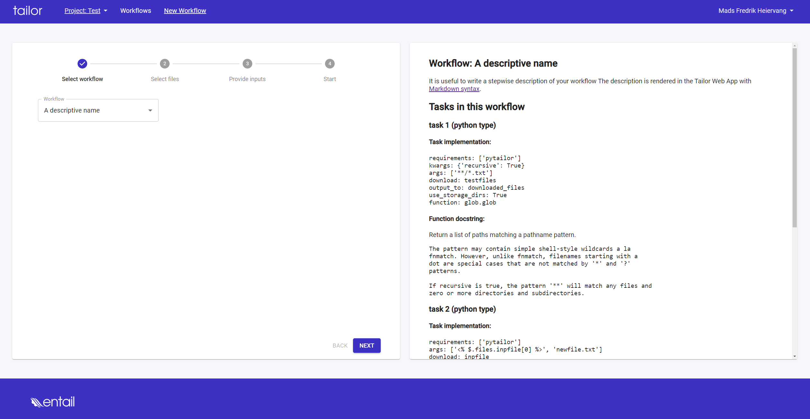

This example shows how to create a workflow definition from an existing workflow

```python

from pytailor import Workflow, Project, FilesSchema, WorkflowDefinition, Account

wf_def_description = """
It is useful to write a stepwise description of your workflow
The description is rendered in the Tailor Web App with 
 [Markdown syntax](https://www.markdownguide.org/basic-syntax/).
"""


prj = Project.from_name("Test")
wf = Workflow.from_project_and_id(prj, 277) # replace with existing wf.id in project
wf_def = WorkflowDefinition.from_workflow(wf, wf_def_description=wf_def_description,
                                          wf_def_name='A descriptive name')

account = Account.get_my_accounts()[0]
wf_def.add_to_account(account)
prj.add_workflow_definition(wf_def.id)

```

The Definition is now available in the Tailor Web App.


